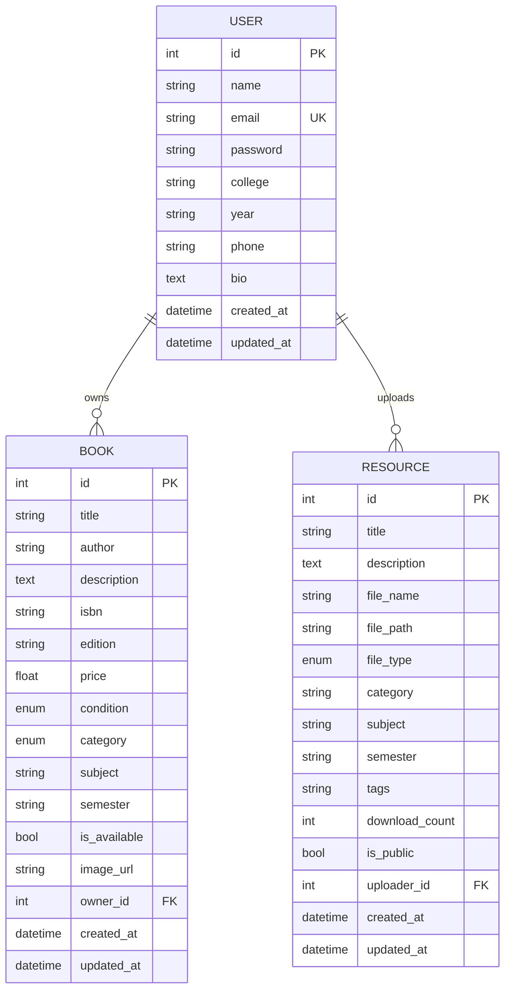

<div align="center">

# 📚 BookBridge

### *Where Students Buy, Sell & Share Knowledge*

[](https://python.org)
[](https://fastapi.tiangolo.com)
[](https://www.sqlalchemy.org)
[](https://jwt.io)
[](https://docker.com)
[](LICENSE)

**BookBridge** is a full-stack platform built for college students to **buy & sell academic textbooks** and **share study resources** — notes, PDFs, assignments, question papers — all in one centralized hub.

[🚀 Getting Started](#-quick-start) · [📡 API Reference](#-api-reference) · [🏗️ Architecture](#%EF%B8%8F-architecture) · [🤝 Contributing](#-contributing)

---

</div>

## ✨ Features

<table>
<tr>
<td width="50%">

### 📖 Book Marketplace
- **List books** with price, condition, category, subject & semester
- **Smart search** across titles and authors
- **Advanced filters** — category, condition, price range
- **Full CRUD** with owner-only authorization
- **9 categories**: Engineering, Medical, Competitive, School, Arts, Science, Commerce, Law, Other
- **5 condition grades**: New → Like New → Good → Fair → Poor
- **Pagination** with configurable page sizes

</td>
<td width="50%">

### 📝 StudyVault — Resource Sharing
- **Upload & share** notes, PDFs, assignments, question papers, presentations
- **Filter** by type, subject, semester, and keyword search
- **Download counter** tracking engagement per resource
- **Tag-based** organization for easy discovery
- **7 resource types**: Notes, PDF, Assignment, Question Paper, Solution, Presentation, Other
- **File storage** with secure upload handling (10 MB max)

</td>
</tr>
<tr>
<td width="50%">

### 🔐 Authentication & Security
- **JWT-based** stateless authentication
- **bcrypt** password hashing (via Passlib)
- **Bearer token** authorization on protected routes
- **Configurable** token expiry (default: 60 min)
- **CORS** middleware with whitelisted origins
- **Global error handling** with structured JSON responses

</td>
<td width="50%">

### 👤 User Profiles
- College, year, phone & bio fields
- View own and other user profiles
- **Cascade relationships** — deleting a user removes all their books & resources
- Profile update support with partial updates
- **Request logging** middleware for monitoring

</td>
</tr>
</table>

---

## 🏗️ Architecture

```
BookBridge/
│
├── app/                              # ⚙️  Backend (FastAPI)
│   ├── main.py                       #     App entry point + router registration
│   ├── config.py                     #     Pydantic Settings (env-driven config)
│   ├── database.py                   #     SQLAlchemy engine, session & Base
│   ├── middleware.py                 #     CORS, request logging, error handler
│   ├── seed.py                       #     Database seeder (demo data)
│   │
│   ├── models/                       #     SQLAlchemy ORM models
│   │   ├── user.py                   #       User model (profile + relationships)
│   │   ├── book.py                   #       Book model + condition/category enums
│   │   └── resource.py              #       Resource model + type enums
│   │
│   ├── schemas/                      #     Pydantic v2 request/response schemas
│   │   ├── user.py                   #       UserCreate, UserUpdate, UserResponse
│   │   ├── book.py                   #       BookCreate, BookUpdate, BookResponse
│   │   └── resource.py              #       ResourceCreate, ResourceResponse
│   │
│   ├── routers/                      #     API route handlers
│   │   ├── auth.py                   #       POST /auth/register, /auth/login
│   │   ├── users.py                  #       GET/PUT /users/me, GET /users/{id}
│   │   ├── books.py                  #       Full CRUD + marketplace browsing
│   │   └── resources.py             #       Upload, browse, download, delete
│   │
│   ├── services/                     #     Business logic layer
│   │   ├── auth_service.py          #       JWT creation, password hashing
│   │   └── file_service.py          #       File upload & storage management
│   │
│   └── utils/
│       └── dependencies.py          #       FastAPI dependency injection (auth)
│
├── frontend/                         # 🎨 Frontend (Vanilla HTML/CSS/JS)
│   ├── index.html                    #     SPA with glassmorphism UI
│   ├── styles.css                    #     28K+ lines of custom CSS
│   ├── app.js                        #     34K+ lines of interactive JS
│   └── *.png                         #     Background images & assets
│
├── tests/                            # 🧪 Test suite (pytest + httpx)
│   ├── conftest.py                   #     Fixtures, test DB & client setup
│   ├── test_auth.py                  #     Auth registration & login tests
│   ├── test_books.py                 #     Book CRUD & marketplace tests
│   └── test_resources.py            #     Resource upload & download tests
│
├── uploads/                          # 📁 File storage directory
├── Dockerfile                        # 🐳 Production container image
├── docker-compose.yml               # 🐳 One-command deployment
├── requirements.txt                  # 📦 Python dependencies
├── .env.example                      # 🔒 Environment variable template
└── .gitignore
```

---

## 🗃️ Database Schema



---

## ⚡ Quick Start

### Prerequisites

- **Python 3.12+**
- **pip** (comes with Python)
- **Git**

### 1️⃣ Clone & Install

```bash
git clone https://github.com/harsh-raj00/BookBridge.git
cd BookBridge

# Create virtual environment
python -m venv venv

# Activate it
venv\Scripts\activate          # Windows
# source venv/bin/activate     # macOS / Linux

# Install dependencies
pip install -r requirements.txt
```

### 2️⃣ Configure Environment

```bash
cp .env.example .env
```

Edit `.env` and set a strong `SECRET_KEY`:

```env
SECRET_KEY=your-super-secret-key-here
ALGORITHM=HS256
ACCESS_TOKEN_EXPIRE_MINUTES=60
DATABASE_URL=sqlite:///./bookbridge.db
```

### 3️⃣ Seed Demo Data *(Optional)*

```bash
python -m app.seed
```

This creates **3 demo users** and **15+ sample books** and **8 study resources** across Engineering, Medical, Commerce & Competitive categories.

<details>
<summary>📧 <strong>Demo Login Credentials</strong></summary>

| Name | Email | Password | College |
|------|-------|----------|---------|
| Rahul Sharma | `rahul@bookbridge.com` | `demo123` | IIT Delhi |
| Priya Patel | `priya@bookbridge.com` | `demo123` | AIIMS Delhi |
| Amit Kumar | `amit@bookbridge.com` | `demo123` | Delhi University |

</details>

### 4️⃣ Run the Server

```bash
uvicorn app.main:app --reload
```

### 5️⃣ Open in Browser

| What | URL |
|------|-----|
| 🌐 **Frontend App** | [http://127.0.0.1:8000](http://127.0.0.1:8000) |
| 📘 **Swagger Docs** | [http://127.0.0.1:8000/docs](http://127.0.0.1:8000/docs) |
| 📗 **ReDoc** | [http://127.0.0.1:8000/redoc](http://127.0.0.1:8000/redoc) |
| 💚 **Health Check** | [http://127.0.0.1:8000/health](http://127.0.0.1:8000/health) |

---

## 🐳 Docker Deployment

```bash
# Build and run with Docker Compose
docker-compose up --build

# Or build manually
docker build -t bookbridge .
docker run -p 8000:8000 --env-file .env bookbridge
```

The app will be available at `http://localhost:8000`.

---

## 🧪 Testing

Run the full test suite with pytest:

```bash
python -m pytest tests/ -v
```

Tests use an **isolated in-memory SQLite database** to avoid polluting production data.

```bash
# Run with coverage (if installed)
python -m pytest tests/ -v --cov=app --cov-report=term-missing
```

---

## 📡 API Reference

> 💡 **Interactive docs are available at** [`/docs`](http://127.0.0.1:8000/docs) **(Swagger UI)** and [`/redoc`](http://127.0.0.1:8000/redoc) **(ReDoc)** when the server is running.

### 🔐 Authentication

| Method | Endpoint | Description | Auth |
|:------:|----------|-------------|:----:|
| `POST` | `/auth/register` | Register a new user account | — |
| `POST` | `/auth/login` | Login & receive JWT access token | — |

### 👤 Users

| Method | Endpoint | Description | Auth |
|:------:|----------|-------------|:----:|
| `GET` | `/users/me` | Get current user's profile | 🔒 |
| `PUT` | `/users/me` | Update profile (college, bio, etc.) | 🔒 |
| `GET` | `/users/{id}` | View any user's public profile | — |

### 📖 Books

| Method | Endpoint | Description | Auth |
|:------:|----------|-------------|:----:|
| `POST` | `/books/` | Create a new book listing | 🔒 |
| `GET` | `/books/` | Browse marketplace (search, filter, paginate) | — |
| `GET` | `/books/categories` | List all categories & conditions | — |
| `GET` | `/books/my-listings` | Get authenticated user's listings | 🔒 |
| `GET` | `/books/{id}` | Get book details by ID | — |
| `PUT` | `/books/{id}` | Update a listing (owner only) | 🔒 |
| `DELETE` | `/books/{id}` | Delete a listing (owner only) | 🔒 |

<details>
<summary>🔍 <strong>Browse Books — Query Parameters</strong></summary>

| Parameter | Type | Description |
|-----------|------|-------------|
| `search` | `string` | Search in title or author |
| `category` | `enum` | Filter by category (engineering, medical, etc.) |
| `condition` | `enum` | Filter by condition (new, like_new, good, fair, poor) |
| `min_price` | `float` | Minimum price filter |
| `max_price` | `float` | Maximum price filter |
| `subject` | `string` | Filter by subject |
| `available_only` | `bool` | Show only available books (default: `true`) |
| `page` | `int` | Page number (default: `1`) |
| `per_page` | `int` | Items per page, 1–50 (default: `10`) |

</details>

### 📝 Resources (StudyVault)

| Method | Endpoint | Description | Auth |
|:------:|----------|-------------|:----:|
| `POST` | `/resources/upload` | Upload a study resource (multipart) | 🔒 |
| `GET` | `/resources/` | Browse all resources (search, filter) | — |
| `GET` | `/resources/{id}` | Get resource details | — |
| `GET` | `/resources/{id}/download` | Download resource file | — |
| `DELETE` | `/resources/{id}` | Delete a resource (owner only) | 🔒 |

### 🛠️ System

| Method | Endpoint | Description | Auth |
|:------:|----------|-------------|:----:|
| `GET` | `/` | Redirects to frontend | — |
| `GET` | `/health` | Health check (status + version) | — |

---

## 🛠️ Tech Stack

| Layer | Technology | Purpose |
|-------|-----------|---------|
| **Runtime** | Python 3.12 | Core language |
| **Framework** | FastAPI 0.115 | Async web framework with auto-docs |
| **ORM** | SQLAlchemy 2.0 | Database modeling & queries |
| **Database** | SQLite | Lightweight, zero-config (swappable to PostgreSQL) |
| **Validation** | Pydantic v2 | Request/response schema validation |
| **Auth** | python-jose + bcrypt | JWT tokens + password hashing |
| **File Uploads** | python-multipart | Multipart form handling |
| **Frontend** | HTML5 / CSS3 / JS | Glassmorphism SPA with animations |
| **Testing** | pytest + httpx | Async HTTP testing |
| **Containerization** | Docker + Compose | One-command deployment |

---

## 🔧 Environment Variables

| Variable | Default | Description |
|----------|---------|-------------|
| `SECRET_KEY` | `your-secret-key-change-in-production` | 🔴 **Change this!** JWT signing key |
| `ALGORITHM` | `HS256` | JWT hashing algorithm |
| `ACCESS_TOKEN_EXPIRE_MINUTES` | `60` | Token expiry duration |
| `DATABASE_URL` | `sqlite:///./bookbridge.db` | Database connection string |
| `UPLOAD_DIR` | `uploads` | File upload directory |
| `MAX_FILE_SIZE_MB` | `10` | Maximum upload file size |
| `DEBUG` | `False` | Enable debug mode |
| `ALLOWED_ORIGINS` | `localhost:3000, localhost:5173` | CORS allowed origins |

---

## 📁 Project Highlights

<details>
<summary>🎨 <strong>Frontend Design</strong></summary>

- **Glassmorphism** login card with frosted glass effect
- **Floating book emoji** animations on the auth page
- **Dashboard** with live stats (total books, my listings, resources, my uploads)
- **Two big action boxes** — quick access to Marketplace & StudyVault
- **Toast notifications** for success/error feedback
- **Responsive** layout that works on mobile & desktop
- **Modal forms** for selling books and uploading resources
- **Debounced search** for smooth filtering experience

</details>

<details>
<summary>⚙️ <strong>Backend Patterns</strong></summary>

- **Layered architecture** — routers → services → models
- **Dependency injection** via FastAPI's `Depends()`
- **Pydantic Settings** with `.env` file support and `@lru_cache`
- **Partial updates** using `model_dump(exclude_unset=True)`
- **Request logging** middleware with response time tracking
- **Global exception handler** for unhandled errors
- **Auto table creation** via `Base.metadata.create_all()`
- **Static file serving** for the frontend SPA

</details>

---

## 🤝 Contributing

Contributions are welcome! Here's how to get started:

```bash
# 1. Fork the repo
# 2. Create a feature branch
git checkout -b feature/amazing-feature

# 3. Make your changes & add tests
python -m pytest tests/ -v

# 4. Commit with a clear message
git commit -m "feat: add amazing feature"

# 5. Push and open a Pull Request
git push origin feature/amazing-feature
```

---

## 🗺️ Roadmap

- [ ] 🖼️ Book image uploads with previews
- [ ] 💬 In-app messaging between buyers and sellers
- [ ] ⭐ User ratings and reviews
- [ ] 🔔 Push notifications for price drops
- [ ] 🔍 Elasticsearch integration for full-text search
- [ ] 📊 Admin dashboard with analytics
- [ ] 🐘 PostgreSQL migration guide
- [ ] 📱 Progressive Web App (PWA) support

---

## 📄 License

This project is licensed under the **MIT License** — see the [LICENSE](LICENSE) file for details.

---

<div align="center">

**Built with ❤️ by [Harsh Raj](https://github.com/harsh-raj00)**

⭐ **Star this repo** if you found it helpful!

[Report Bug](https://github.com/harsh-raj00/BookBridge/issues) · [Request Feature](https://github.com/harsh-raj00/BookBridge/issues)

</div>
